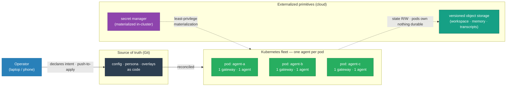
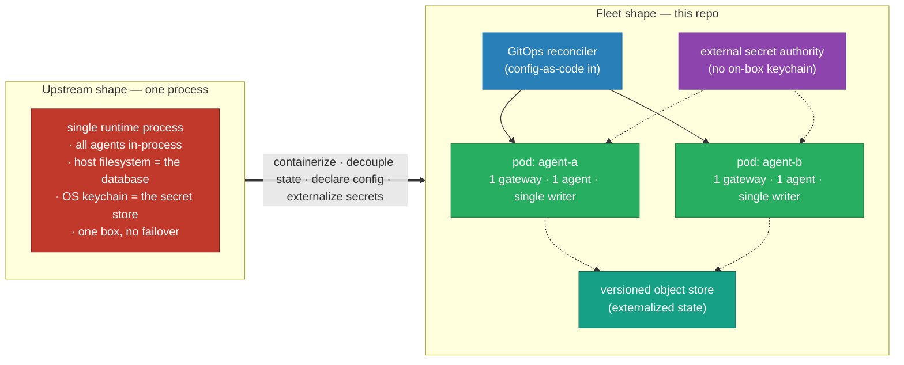
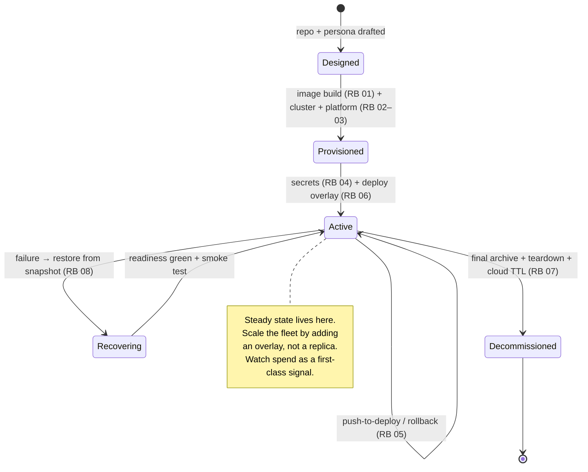

# OpenClaw on Kubernetes

### Declarative Kustomize manifests that run the OpenClaw AI-agent runtime as a stateless, single-writer pod-per-agent fleet on Kubernetes.

> **Thesis.** The runtime talks like a distributed system — "agents," "sessions," "sub-agents" — but
> ships as **one operating-system process** that owns a filesystem and a keychain. That's perfect for
> a laptop and wrong for a fleet: one crash takes every agent down, the filesystem *is* the database
> so the agent is welded to its box, and "more agents" means "more threads on one machine." This repo
> resolves that tension — it keeps the runtime unforked and turns it into a fleet of replaceable pods
> where any node can run any agent, a dead node is a non-event, and every change to a running agent is
> a reviewed commit.

<!-- START_GENERATED:docs/diagrams/src/hero.mermaid -->

<!-- END_GENERATED:docs/diagrams/src/hero.mermaid -->

---

This is a sanitized reference implementation. Its **primary deployment profile** is a self-hosted
**K3s** cluster on owned hardware consuming **GCP services** — GCS for state, Google Secret Manager
for credentials, Pub/Sub for egress-only inbound events — chosen because it's the cheapest viable
shape for a single-operator fleet. The architecture itself is substrate-agnostic; a fully managed
control plane is an additive [profile](docs/LLD.md#environment-profiles), not a rewrite.

## Table of Contents

- [Business Case](#business-case)
- [Cost Model](#cost-model)
- [Why This Approach](#why-this-approach)
- [The Welds](#the-welds)
- [Architecture at a Glance](#architecture-at-a-glance)
- [Key Architecture Decisions](#key-architecture-decisions)
- [Lifecycle, Operations & Support](#lifecycle-operations--support)
- [Repository Layout](#repository-layout)
- [Quick Start](#quick-start)
- [Design Docs](#design-docs)
- [Scope & Constraints](#scope--constraints)
- [License](#license)

> This file is the entry point — business case, cost, the thesis, one glance diagram, and links. It
> *summarizes*; the deep mechanics (config internals, secrets wiring, state decoupling) live in the
> [HLD](docs/HLD.md) (why, agnostic) and [LLD](docs/LLD.md) (how, specific).

---

## Business Case

The pain is twofold. **Fragility:** a single-process runtime welds every agent to one box's
filesystem and keychain — lose the box, lose the fleet, recover by hand over an evening.
**Uncontrolled spend:** for an agent fleet the dominant variable cost is model inference, and a fleet
that heartbeats or polls on a timer bills *continuously for no delivered work*.

### Financial Comparison Matrix

| Expense Class | Single-process baseline | Managed-K8s fleet | **This design (hybrid K3s + cloud)** |
|---|---|---|---|
| **Initial CapEx** | $0 (one box you own) | $0 | owned nodes (sunk; amortized) |
| **Recurring OpEx (infra)** | ~$0 | **~$72/mo+ control-plane fee** + node-hours | **≈ $7–10/mo** (electricity + near-free cloud services) |
| **MTTR on node failure** | hours (manual re-host) | minutes (managed HA) | **minutes** (stateless pod re-pulls state) |
| **Runtime spend visibility** | none | none by default | **per-agent budget alerts + per-turn token logging** |
| **Licensing** | $0 | $0 (OSS) | $0 (OSS) |

*ROI Conclusion:* the substrate is a rounding error; the design pays for itself the first time a node
dies and the fleet keeps running — and, more durably, by making the expensive plane (model spend)
*visible per agent* before it becomes a bill. Sourced figures: [COST-MODEL.md](docs/COST-MODEL.md).

---

## Cost Model

> Summary only — full sourced breakdown in **[docs/COST-MODEL.md](docs/COST-MODEL.md)**.

Two cost planes, kept separate because they behave nothing alike:

| Plane | What drives it | This design's posture | Est. |
|---|---|---|---|
| **Infrastructure** | substrate: compute, storage, network, control plane | local K3s (free control plane) + a few metered cloud services | **≈ $7–10/mo** |
| **Runtime / intelligence** | model inference: turn volume × tier | route cheap/bulk to a cheap tier; reserve frontier for hard reasoning | **≈ $14–160/mo per agent** |

- **Local vs cloud-managed:** the hybrid avoids the ~$72/mo managed control-plane fee and all
  node-hours, trading them for owned hardware (sunk) + your time as operator ([COST-MODEL §1](docs/COST-MODEL.md#1-infrastructure-plane--substrate-cost)).
- **Model spend (the big three + local):** Haiku/GPT-4o-mini/Gemini-Flash for routing and bulk; Opus/
  Gemini-Pro for hard reasoning; local models above their amortization crossover ([COST-MODEL §2](docs/COST-MODEL.md#2-runtime--intelligence-plane--model-cost)).
- ⚠️ **Runtime cost traps:** heartbeats, polling, retry storms and idle reasoning bill **continuously
  even with no work**. Default heartbeats **off**, prefer event-driven wakes, wire per-agent budget
  alerts. Full list: [COST-MODEL §3](docs/COST-MODEL.md#3-️-runtime-cost-traps-read-before-deploying).

---

## Why This Approach

**Declarative over imperative.** If it can be a file reconciled into the cluster, it is; a push/apply
is the only way to change running state, so config history *is* Git history and rollback is a revert.

**Externalize the durable primitives, own nothing on the pod.** State, secrets, and inbound events
each go to the primitive that's actually good at them — versioned object storage, an external secret
authority, an event bus — so the pod is genuinely stateless and any node can run any agent.

**Private-first exposure.** An agent wields privileged tools (shell, HTTP), so no agent sits on the
public internet: access is over a private mesh, inbound events arrive by egress-only pull, and the
network is default-deny.

**Treat spend as a resource.** Uniquely for AI workloads, the expensive plane is the intelligence,
not the iron — so token/turn cost is monitored and capped like CPU or memory.

The specific products behind these are argued in the [ADRs](docs/adr/README.md).

---

## The Welds

If you read nothing else: this repo takes a single-process runtime and welds four host dependencies —
process, state, config, secrets — onto cloud-native primitives, so the runtime becomes a fleet
without being forked. The welds, stated as primitives:

| Weld | Out of the box | What this repo does |
|---|---|---|
| **Workload primitive** | all agents in one process on one box | one agent per pod, `replicas:1` + `Recreate` + PDB — single-writer by composition; scale by adding a pod, not a replica |
| **State primitive** | the host filesystem *is* the database | externalized to versioned object storage; pod owns nothing durable (emptyDir scratch); any node runs any agent |
| **Config primitive** | mutable config in `~/.openclaw`, drift-prone | config-as-code, projected read-only + immutable-config mode; the only change path is a commit |
| **Secret primitive** | the OS keychain on one host | sealed seed → external secret authority → short-lived in-cluster secret; no static cloud key in the pod |
| **Exposure primitive** | bound to one host's network | private mesh + default-deny + egress-only inbound; no agent on the public internet |
| **Recovery primitive** | copy the folder, hope | client-encrypted hourly snapshots + a weekly *verified* restore drill |

---

## Architecture at a Glance

<!-- START_GENERATED:docs/diagrams/src/architecture_at_a_glance.mermaid -->

<!-- END_GENERATED:docs/diagrams/src/architecture_at_a_glance.mermaid -->

The deeper, role-generic view is the [HLD overview](docs/HLD.md#6-architecture); the concrete,
named-product topology is the [LLD topology](docs/LLD.md).

---

## Key Architecture Decisions

The load-bearing calls are [ADRs](docs/adr/README.md) — each names the alternatives that were genuine
candidates and *why they lost*.

| ADR | Decision | Rejected alternatives |
|---|---|---|
| [0001](docs/adr/0001-workload-primitive-deployment-over-statefulset.md) | Single-replica `Deployment` + `Recreate` + PDB | StatefulSet (sticky PVCs we don't want), DaemonSet (wrong cardinality) |
| [0002](docs/adr/0002-secrets-external-operator-over-sealed-vault.md) | External secrets operator + cloud secret manager via workload identity | Sealed Secrets (no external authority), Vault Agent (per-pod sidecar weight) |
| [0003](docs/adr/0003-state-transport-object-store-over-pvc.md) | Versioned object storage for state | per-agent PVC (re-welds to a node), RWX volume (corruption trap) |
| [0004](docs/adr/0004-backup-restic-over-velero.md) | Client-encrypted restic CronJob | Velero (PV/cluster-resource focus), CSI snapshots (not portable) |
| [0005](docs/adr/0005-exposure-private-mesh-over-public-ingress.md) | Private mesh + default-deny | public ingress / LB per agent (privileged runtime on the internet) |
| [0006](docs/adr/0006-config-immutability-read-only-over-writable.md) | Read-only mounts + immutable-config mode | writable config (drift), RO mount alone (insufficient) |
| [0007](docs/adr/0007-profile-local-k3s-gcp-over-managed-k8s.md) | Self-hosted K3s + cloud services | managed control plane (fee + node-hours), fully self-hosted (labor explosion) |

---

## Lifecycle, Operations & Support

The full lifecycle is owned here — **provision → deploy → operate → maintain → decommission** — not
just day-zero install. The operating model (monitoring incl. **spend**, capacity, upgrades, support
tiers, break-fix) lives in **[docs/OPERATIONS.md](docs/OPERATIONS.md)**.

<!-- START_GENERATED:docs/diagrams/src/lifecycle.mermaid -->

<!-- END_GENERATED:docs/diagrams/src/lifecycle.mermaid -->

| Phase | Owns | Where |
|---|---|---|
| **Day-0 Provision** | image, cluster, identity, secret store, networking, backup target | [OPERATIONS](docs/OPERATIONS.md#day-0--provision-stand-it-up) + [profile runbooks](docs/runbooks/README.md) |
| **Day-1 Deploy** | first deploy + smoke test + proven rollback | [runbooks](docs/runbooks/README.md) |
| **Day-2 Operate** | monitoring, capacity, upgrades, **spend**, backup/restore drills | [OPERATIONS](docs/OPERATIONS.md#day-2--operate-run-it-like-it-matters) |
| **Support / break-fix** | self-heal → operator → escalation tiers | [OPERATIONS](docs/OPERATIONS.md#support-model--break-fix) |
| **Day-N Decommission** | final archive, teardown, **no orphaned cloud spend** | [runbook 07](docs/runbooks/_common/07-decommission/RUNBOOK.md) |

Each transition is a documented runbook, not tribal knowledge. **Runbooks are split by
[deployment profile](docs/runbooks/README.md#the-deployment-profile-model)** — the primary target is
written concretely, with room to add others (managed K8s, another cloud) without rewriting the core.

---

## Repository Layout

```
openclaw-k8s-manifests/
├── README.md                  # you are here — business case, justification, summary, links
├── LICENSE                    # MIT
│
├── docs/
│   ├── HLD.md                 # vendor-AGNOSTIC: primitives, controls, patterns, the "what & why"
│   ├── LLD.md                 # vendor-SPECIFIC: products, versions, addresses, CLI, profiles
│   ├── COST-MODEL.md          # infra plane + AI-model/runtime plane + cost traps (sourced)
│   ├── OPERATIONS.md          # Day-0/1/2 + support model, monitoring, break-fix, lifecycle
│   ├── adr/                   # MADR decision records — alternatives considered + why they lost
│   ├── diagrams/src/          # Mermaid sources (single source of truth, injected into docs)
│   └── runbooks/              # split by deployment profile
│       ├── _common/           #   profile-independent: image build, update, decommission
│       ├── profile-local-k3s-gcp/   # PRIMARY target, written concretely
│       └── profile-managed-k8s/     # extension pattern for GKE/EKS/AKS
│
├── manifests/                 # THE deliverable: Kustomize base + overlays + platform
│
└── scripts/                   # local mirrors of CI gates + build_docs.py (diagram injector)
```

## Quick Start

> Full detail in [`docs/runbooks/`](docs/runbooks/README.md). Placeholders (`example.internal`,
> `REPLACE_*`) must be adapted to your environment.

```bash
# 1. Provision the platform primitives (secret store + backup jobs), once per cluster
kustomize build manifests/platform | kubectl apply -f -

# 2. Deploy one agent (copy the example overlay, set identity + digest first)
kustomize build manifests/overlays/example | kubectl apply -f -
kubectl -n example rollout status deploy/example-workload --timeout=180s

# 3. Reproduce the CI gate locally
scripts/preflight.sh && scripts/validate.sh
python3 scripts/build_docs.py     # re-inject diagrams after editing a source
```

## Design Docs

- **[High-Level Design](docs/HLD.md)** — agnostic: the problem, the keystone single-writer
  constraint, goals/non-goals, principles, controls/patterns, lifecycle, risks.
- **[Low-Level Design](docs/LLD.md)** — specific: deployment profiles, concrete products, versions,
  addresses, commands, failure modes.
- **[Cost Model](docs/COST-MODEL.md)** — infra plane (local vs managed) + runtime plane (model spend,
  the big three vs local) + the runtime cost traps.
- **[Operations & Support](docs/OPERATIONS.md)** — Day-0/1/2, monitoring incl. spend, capacity,
  upgrades, support tiers, break-fix, clean decommission.
- **[Architecture Decision Records](docs/adr/README.md)** — MADR format, each with the alternatives
  genuinely considered and why they were rejected.

## Scope & Constraints

- **In scope:** orchestrating the unforked runtime as a fleet — workload shape, externalized state,
  config-as-code, secrets model, exposure, backup/restore, the full lifecycle, and cost discipline.
- **Out of scope (intentionally):** modifying the runtime's source; multi-tenant SaaS; public agent
  endpoints; sharing one gateway across hosts; agents bound to a desktop-OS keychain or app; the
  embedding/retrieval index itself (upstream application logic).
- **Known constraints / accepted risks:** single-writer is enforced by composition + an alert, not by
  the primitive intrinsically (R1); object-store reachability depends on the local uplink (R2);
  you are the SRE for the control plane on the primary profile. Full register:
  [HLD §12](docs/HLD.md#12-risks--open-questions).

## License

MIT — see [LICENSE](LICENSE).
