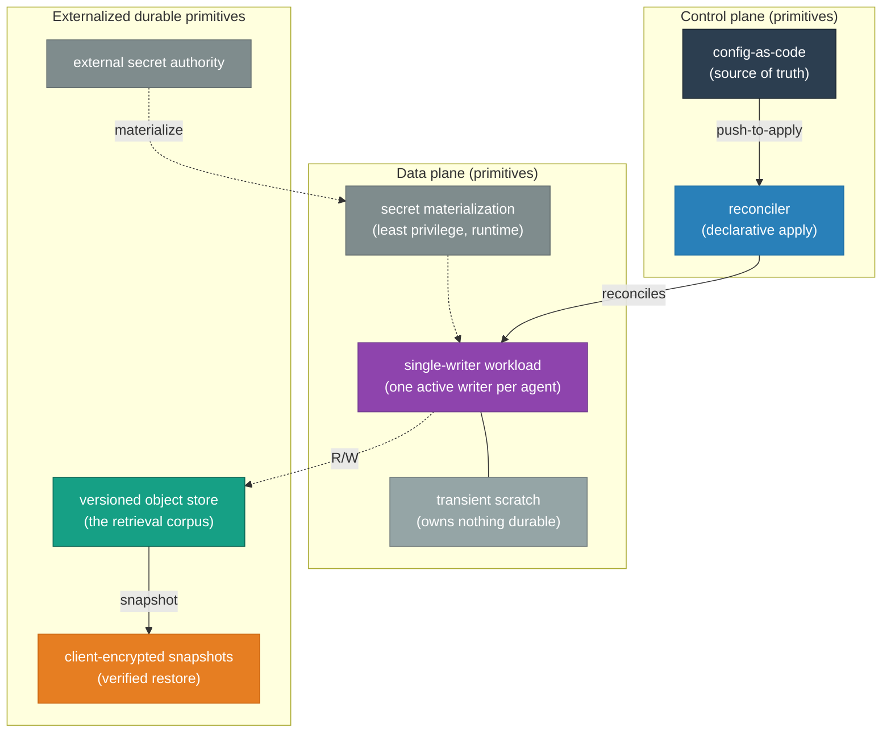
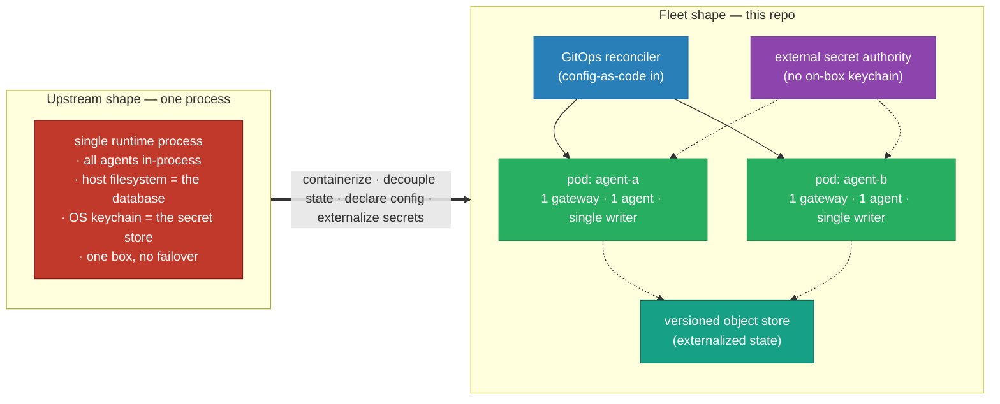
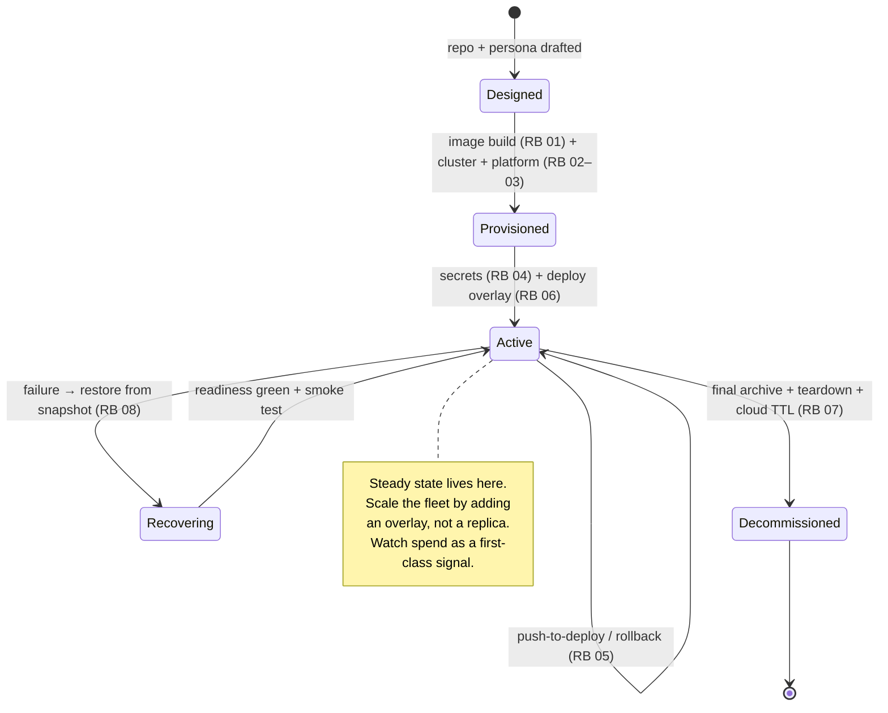

# OpenClaw on Kubernetes — High-Level Design

<!-- START_GENERATED:docs/diagrams/src/hld_overview.mermaid -->

<!-- END_GENERATED:docs/diagrams/src/hld_overview.mermaid -->

*The picture first: three primitives — a single-writer workload, config reconciled in from a
source of truth, and durable state externalized out — and the relationships between them. Everything
that follows is an elaboration of this one diagram.*

## Contents

1. [Purpose](#1-purpose)
2. [The Workload Under Design](#2-the-workload-under-design)
3. [Business Case & ROI](#3-business-case--roi)
4. [Goals & Non-Goals](#4-goals--non-goals)
5. [Design Principles](#5-design-principles)
6. [Architecture](#6-architecture)
7. [Controls, Protocols & Patterns](#7-controls-protocols--patterns)
8. [Lifecycle](#8-lifecycle)
9. [Backup, Recovery & Operations](#9-backup-recovery--operations)
10. [Portability](#10-portability)
11. [Architecture Decision Records](#11-architecture-decision-records)
12. [Risks & Open Questions](#12-risks--open-questions)

---

## 1. Purpose

This design takes an AI-agent runtime that ships as **one operating-system process** and makes it
run as a **fleet of independent, replaceable pods** on Kubernetes. The boundary is deliberate: we
orchestrate the runtime, we do not fork it. The win we are after is operational — any node can run
any agent, a dead node is a non-event, and every change to a running agent is a reviewed commit
rather than a hand edit on a live box.

The whole document is vendor-agnostic by design. Concrete products, versions, and addresses live in
the [LLD](LLD.md); the load-bearing choices behind them are argued in the [ADRs](adr/README.md).

## 2. The Workload Under Design

Every decision downstream — the workload primitive, the state primitive, the single-writer rule,
the backup posture — follows from *what this workload actually is*. So before any Kubernetes shape,
a precise definition of the thing being orchestrated.

### 2.1 An agent runtime, not a stateless web service

The reflexive Kubernetes instinct is "it's a stateless container behind a Service — `Deployment`
it." That instinct is half right and exactly half wrong, and the wrong half is what makes this
design interesting.

An **agent** is a long-lived **orchestration loop**, not a function invocation. In one turn it
receives an inbound event (a channel message, a scheduled wake, a sub-agent result), assembles
context from its persona files and its memory corpus, runs a reasoning step that decides whether to
act, optionally calls a privileged tool (shell, browser, HTTP, spawning a sub-agent), observes the
result, loops, and finally **mutates durable state** — appending to a transcript, updating its
memory — before it replies.

Three properties of that loop drive the rest of this document:

- **It is stateful, but the state is not a database engine.** The "database" is an append-heavy
  corpus of markdown memory files, daily logs, and transcripts on a filesystem. That *shape* is why
  the right state primitive is versioned object storage with file-level snapshots (§7, §9) — not a
  block volume pretending to be Postgres.
- **It is long-lived and conversational.** A turn can run for minutes across many tool calls, with
  in-flight context that a naive "just add replicas" model would shard into incoherence.
- **It wields privileged tools.** An agent can run shell commands and reach external APIs. That is
  precisely why blast-radius isolation is a first-class primitive here, not a checkbox.

### 2.2 The memory corpus is a retrieval substrate, not "some state"

A reviewer will reasonably ask whether this is a RAG system. In the broad sense, **yes** — and
naming it reframes the most important primitive in the design. Each turn, the agent performs
retrieval-augmented generation: before reasoning, it pulls relevant prior context out of its memory
substrate (curated long-term memory, daily logs, prior transcripts) and injects it. The retrieval
may be semantic or rule-based; the architecture is the same — **a generation step augmented by
retrieval from a persistent corpus the agent itself writes to.**

This is the load-bearing reframe. The memory files are **not** "state to back up." They are the
agent's episodic memory and retrieval corpus — the thing that makes the agent *itself* across
restarts. That is *why* the state primitive exists at all (lose the corpus, lose the agent), *why*
backups are frequent and restore-verified (the corpus is the product), and *why* the single-writer
property below is non-negotiable.

> **Scope honesty:** this design orchestrates that retrieval-augmented runtime; it does not
> implement the retrieval index itself (that is upstream application logic). The architectural claim
> is about *how the corpus is hosted, isolated, persisted, and recovered* — not about an embedding
> model.

### 2.3 The keystone constraint: single-writer

Here is the invariant everything bends around. The runtime mutates its append-heavy corpus and live
transcripts **with no internal concurrency control and no distributed locking** — it was written
assuming exactly one process owns the filesystem. Point two runtime instances at the same corpus and
they interleave writes and corrupt both. There is no last-writer-wins reconciliation to fall back
on; there is just corruption.

This one property is the keystone. It is the direct reason for **one agent per pod** with exactly
one active writer ([ADR-0001](adr/0001-workload-primitive-deployment-over-statefulset.md)), for
**externalized state instead of a shared volume**
([ADR-0003](adr/0003-state-transport-object-store-over-pvc.md)), and for a restore model that scales
to zero before it restores ([ADR-0004](adr/0004-backup-restic-over-velero.md)). Keep it in mind:
most of the "why" below traces straight back here.

## 3. Business Case & ROI

The economic argument, vendor-agnostic. The pain we are solving is twofold. First, **fragility**: a
single-process runtime welds every agent to one box's filesystem and one box's keychain — lose the
box, lose the fleet, and recover by hand. Second, and larger, **uncontrolled spend**: for an
AI-agent fleet the dominant variable cost is model inference, and a fleet that polls or heartbeats
on a timer bills continuously for no delivered work.

The full sourced breakdown — the infrastructure plane (local vs cloud-managed) **and** the
runtime/intelligence plane (model spend plus the cost traps) — lives in
**[COST-MODEL.md](COST-MODEL.md)**. The decision-relevant headline: at single-operator fleet scale
the **substrate is a rounding error** (≈ $7–10/mo for the hybrid profile) while **model inference
dominates** (≈ $14–160/mo per agent, depending entirely on routing and turn volume). The design's
ROI is therefore measured less in saved infrastructure dollars than in two things money can't buy
back cheaply: a node failure that costs minutes instead of an evening, and a spend signal that is
*visible per agent* before it becomes a bill.

> For agent workloads the cost story is the inverse of most infrastructure: the expensive plane is
> the intelligence, not the iron. Heartbeats and polling are a design risk, not an afterthought —
> see [COST-MODEL §3](COST-MODEL.md#3-️-runtime-cost-traps-read-before-deploying) and the risk
> register (§12).

## 4. Goals & Non-Goals

### Goals

| # | Goal |
|---|---|
| G1 | **One agent per pod** — an agent's blast radius is its own pod and namespace. |
| G2 | **Scale by adding an overlay**, not by adding replicas; the base never changes to add an agent. |
| G3 | **Stateless pod** — any node can run any agent; no persistent volume on the agent. |
| G4 | **Durable state externalized** to versioned, client-encrypted object storage. |
| G5 | **No plaintext secret in Git, ever**; the runtime resolves secrets in-cluster from an external authority. |
| G6 | **Every lifecycle transition is a pipeline** (deploy, update, restore, decommission) — no snowflake procedures. |
| G7 | **Substrate-agnostic** — the same design runs on self-hosted edge K8s or a managed cloud control plane. |
| G8 | **A failed agent restores to a known-good state in minutes**, from a *verified* backup. |
| G9 | **Spend is observable and capped per agent** — the runtime plane is a first-class operational signal. |

### Non-Goals

- **Modifying the runtime's source.** We containerize and orchestrate; we don't fork.
- **Multi-tenant SaaS.** This is a single operator's fleet, not endpoints for external users.
- **Public agent endpoints.** Agents are reachable over a private overlay; at most one dedicated
  webhook path is ever exposed.
- **Sharing one gateway across hosts.** The runtime can't; the fleet shape embraces one gateway
  process per pod.
- **Agents bound to a desktop-OS userland.** Anything welded to a specific desktop keychain or
  messaging app stays on that host; this fleet is for the programmatic, Linux-friendly agents.

## 5. Design Principles

These are the rules we invoke later to adjudicate trade-offs:

1. **Stateless application, stateful backend.** The pod is ephemeral; the corpus is durable and
   lives elsewhere.
2. **Strict separation of config and state.** Human-authored config is versioned in Git;
   machine-generated state lives in object storage. They never mix.
3. **Declarative over imperative.** If it can be a file reconciled into the cluster, it is. A
   push/apply is the only way to change running state.
4. **Least privilege per primitive.** An agent gets only the channels, secrets, and egress it needs.
5. **Every change has a rollback.** Config rolls back by Git revert; state by object versioning;
   image by digest pin.
6. **Secrets resolve at runtime, never at rest in the clear.** A Git seed is sealed; the runtime
   authority is an external secret store reached by workload identity.
7. **A backup nobody has restored is not a backup.** Recovery is verified on a schedule, not assumed.
8. **Spend is a signal.** For agent workloads, token/turn cost is monitored and capped like any
   other resource.

## 6. Architecture

The transformation, in one picture — one process pretending to be a fleet becomes a real fleet of
stateless, single-writer pods:

<!-- START_GENERATED:docs/diagrams/src/architecture_at_a_glance.mermaid -->

<!-- END_GENERATED:docs/diagrams/src/architecture_at_a_glance.mermaid -->

The fleet is built from a small set of primitives and the relationships between them:

- **The workload primitive** — *one agent per pod*, with exactly one active writer at a time. The
  unit of scale is the agent, not the replica. Adding capacity means adding a pod (an overlay); it
  never means raising a replica count, because two writers for one corpus is corruption (§2.3).
  Single-writer is enforced by composition — a single-replica workload with a recreate-style
  rollout (old writer fully gone before the new one starts) and a disruption budget that guards the
  one writer. The workload API choice is argued in
  [ADR-0001](adr/0001-workload-primitive-deployment-over-statefulset.md).
- **The isolation primitive** — *namespace per agent*. Blast radius is one namespace; decommission
  is a single namespace deletion; east-west traffic is default-deny so reaching one agent never
  implies reaching another.
- **The config primitive** — *config as code*, reconciled in from a source of truth and projected
  **read-only** into the pod. The running config provably equals the committed config; a pod cannot
  rewrite its own guardrails ([ADR-0006](adr/0006-config-immutability-read-only-over-writable.md)).
- **The secret primitive** — a layered model: a sealed seed in Git for recovery, an external secret
  authority as the runtime source, and a short-lived in-cluster secret as the last mile. The pod
  only ever reads the last-mile secret; it never holds a cloud credential
  ([ADR-0002](adr/0002-secrets-external-operator-over-sealed-vault.md)).
- **The state primitive** — *externalized, versioned object storage*. The pod owns nothing durable
  (a transient scratch volume only); a rescheduled pod pulls its prefix and resumes
  ([ADR-0003](adr/0003-state-transport-object-store-over-pvc.md)).
- **The exposure primitive** — a *private overlay mesh* with default-deny, and at most one dedicated
  webhook ingress. A tool-wielding runtime never sits on the public internet
  ([ADR-0005](adr/0005-exposure-private-mesh-over-public-ingress.md)).

**Substrate-agnostic by design.** The architecture is expressed independent of where it runs;
concrete targets are **profiles** defined in
[LLD §Environment Profiles](LLD.md#environment-profiles). The primary profile is a self-hosted
cluster consuming managed cloud services for state, secrets, and inbound events; a fully managed
control plane is an additive profile, not a rewrite
([ADR-0007](adr/0007-profile-local-k3s-gcp-over-managed-k8s.md)).

## 7. Controls, Protocols & Patterns

The subsystems by concern, agnostic:

- **Configuration management.** Desired state — runtime config and persona — is declared as code,
  compiled into a read-only projection, and mounted immutably. The single change path is a commit
  → reconcile → rollout; in-pod mutation is refused, not merely discouraged.
- **State / data.** The durable corpus is classified as the product. Compute and storage are
  separated absolutely: the pod is stateless, the corpus lives in versioned object storage. Object
  versioning provides cheap per-object point-in-time recovery; snapshots layer whole-corpus recovery
  on top.
- **Secrets.** Layered as *seed → external authority → runtime materialization*. The seed (sealed,
  in Git) bootstraps and break-glasses; the external authority is the live source, reached by
  workload identity so no static cloud credential ever sits in the cluster; the materialized
  in-cluster secret is least-privilege and per agent.
- **Network / exposure.** Default-deny in both directions. Ingress only from the designated
  ingress/mesh zone to the agent's port; egress narrowed to DNS, secure outbound for model/storage/
  channel APIs, with link-local/metadata ranges excluded. The exposure posture is private-first.
- **Identity & access.** Each agent runs under its own service identity bound to a cloud identity by
  workload identity; least privilege is expressible and reviewable per agent in its overlay.

## 8. Lifecycle

The full lifecycle as a state machine — provision → deploy → operate → recover → decommission. Each
transition maps to a numbered runbook; none is a tribal-knowledge checklist.

<!-- START_GENERATED:docs/diagrams/src/lifecycle.mermaid -->

<!-- END_GENERATED:docs/diagrams/src/lifecycle.mermaid -->

| Transition | Trigger | What happens |
|---|---|---|
| **Provision** | first time | image built + pinned by digest; cluster + platform primitives stood up |
| **Deploy** | per agent | secrets loaded; overlay applied → namespace, config, secret, workload; smoke test |
| **Update** | push to the source of truth | re-render → reconcile → readiness gate |
| **Recover** | failure + restore point | scale the writer to zero → restore corpus → scale to one → smoke test |
| **Decommission** | retire an agent | final snapshot → delete the namespace → object prefix on TTL → repo archived |

The operating model that says *when* to run these and *who* owns *what* lives in
[OPERATIONS.md](OPERATIONS.md).

## 9. Backup, Recovery & Operations

The corpus is the product, so recovery is engineered, not hoped for. Intent: a low RPO via frequent
snapshots and a low RTO because a stateless pod recovers by pulling its prefix. Three complementary
recovery interfaces cover the failure surface — object versioning rolls back a single object, a
client-encrypted snapshot engine restores the whole corpus, and the source of truth reconstructs the
cluster shape. Critically, recovery is **verified**: a scheduled drill restores a snapshot and
smoke-tests the recovered state, because integrity-checking a backup you never restored proves
nothing. Operationally, the signals that matter are liveness, capacity headroom, backup success,
and — uniquely for this workload — **per-agent spend**.

## 10. Portability

The design assumes only that its substrate offers the generic primitives it names: somewhere to run
a single-writer pod, an external secret authority reachable by workload identity, versioned object
storage, and a private network path. It deliberately assumes nothing about a specific hardware node,
a proprietary storage class, or a hyperscaler. Where the pods physically land is immaterial; that is
what lets the same base run on a self-hosted edge cluster or a managed cloud one, with only a
profile's worth of difference between them.

## 11. Architecture Decision Records

The load-bearing decisions are recorded as MADR-format [ADRs](adr/README.md). Each states the
alternatives that were genuine candidates and *why they lost* — the reflexive choice we rejected is
usually the most useful entry.

| ADR | Decision |
|---|---|
| [0001](adr/0001-workload-primitive-deployment-over-statefulset.md) | Workload primitive: single-replica `Deployment` + `Recreate` + PDB over StatefulSet/DaemonSet |
| [0002](adr/0002-secrets-external-operator-over-sealed-vault.md) | Secrets: external secrets operator + cloud secret manager over Sealed Secrets / Vault Agent |
| [0003](adr/0003-state-transport-object-store-over-pvc.md) | State transport: versioned object storage over PVC / RWX volume |
| [0004](adr/0004-backup-restic-over-velero.md) | Backup engine: client-encrypted restic over Velero / CSI snapshots |
| [0005](adr/0005-exposure-private-mesh-over-public-ingress.md) | Exposure: private mesh + default-deny over public ingress / LoadBalancer |
| [0006](adr/0006-config-immutability-read-only-over-writable.md) | Config immutability: read-only mounts + immutable-config mode over writable config |
| [0007](adr/0007-profile-local-k3s-gcp-over-managed-k8s.md) | Primary profile: self-hosted K3s + cloud services over a managed control plane |

## 12. Risks & Open Questions

| # | Risk / Question | Likelihood · Impact | Mitigation · Detection |
|---|---|---|---|
| R1 | Two writers for one agent corrupt the corpus | low · high | single replica + recreate rollout + PDB + a `replicas != 1` alert; restore drills surface corruption |
| R2 | Object-store outage blocks durable writes | low · med | serve from memory/scratch, queue writes, alert on sync failure; corpus stays consistent |
| R3 | Secret authority / workload-identity misconfig blocks resolution | med · high | operator surfaces a sync error; the sealed Git seed is the break-glass path |
| R4 | Over-permissive base egress | med · med | base allows broad secure egress for portability; hardened overlay narrows to explicit CIDRs / an egress gateway |
| R5 | Image supply chain compromise | low · high | digest-pinned images, signed builds, registry scanning (overlay concern) |
| R6 | A backup that passes integrity but fails app-level restore | med · high | the drill restores *and* smoke-tests recovered state, not just integrity |
| R7 | **Runaway model spend** (heartbeat/poll/retry storm) | med · high | heartbeats default off, event-driven wakes, per-agent budget alert + per-turn token logging ([COST-MODEL §3](COST-MODEL.md#3-️-runtime-cost-traps-read-before-deploying)) |
