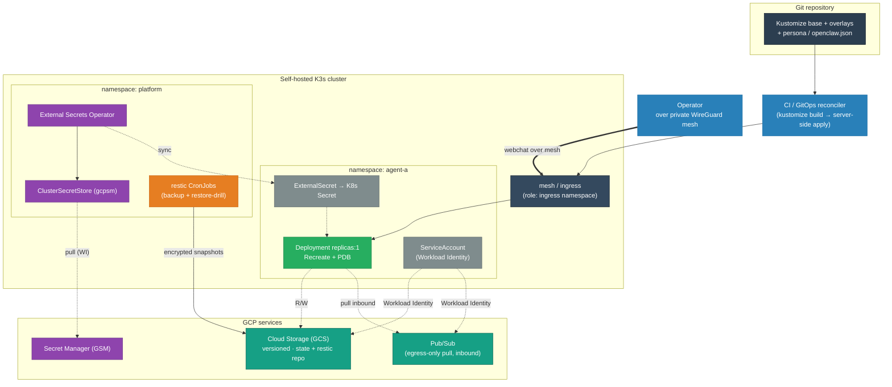

# OpenClaw on Kubernetes — Low-Level Design

<!-- START_GENERATED:docs/diagrams/src/lld_topology.mermaid -->

<!-- END_GENERATED:docs/diagrams/src/lld_topology.mermaid -->

*The concrete shape: the same primitives as the [HLD overview](HLD.md#6-architecture), now named —
K3s, GCS, Google Secret Manager, the External Secrets Operator, Pub/Sub. This is the primary profile
made real; everything below fills in the wiring.*

## Contents

- [Environment Profiles](#environment-profiles)
1. [Component Inventory & Versions](#1-component-inventory--versions)
2. [Concrete Topology & Addressing](#2-concrete-topology--addressing)
3. [The Deliverable: Structure](#3-the-deliverable-structure)
4. [Configuration — Concrete](#4-configuration--concrete)
5. [Secrets — Concrete Wiring](#5-secrets--concrete-wiring)
6. [Networking — Concrete](#6-networking--concrete)
7. [Backup & Restore — Concrete Commands](#7-backup--restore--concrete-commands)
8. [CI/CD Pipelines](#8-cicd-pipelines)
9. [Lifecycle Commands](#9-lifecycle-commands)
10. [Failure Modes](#10-failure-modes)

---

## Environment Profiles

The LLD is written against a **primary deployment profile**, concretely. Other targets are additive
profiles, not rewrites. This section is the contract a new profile must satisfy; the per-target
procedures live under [`runbooks/profile-*`](runbooks/README.md).

**Primary profile: `local-k3s-gcp`** — self-hosted K3s on owned hardware, consuming GCP services
(GCS for state, Google Secret Manager for credentials, Pub/Sub for egress-only inbound events). It is
the cheapest viable shape for a single-operator fleet (no managed control-plane fee, no node-hours);
the choice and its rejected alternatives are recorded in
[ADR-0007](adr/0007-profile-local-k3s-gcp-over-managed-k8s.md), and the economics in
[COST-MODEL §1](COST-MODEL.md#1-infrastructure-plane--substrate-cost).

Each profile specifies the same axes, so swapping targets is mechanical:

| Axis | `local-k3s-gcp` (primary) | `managed-k8s` (extension) |
|---|---|---|
| Cluster provisioning | self-host K3s on owned nodes | managed CP + node pool (Terraform) |
| Identity model | GCP Workload Identity (KSA ↔ GSA) | GKE WI / EKS IRSA / AKS Workload Identity |
| Secret store | Google Secret Manager via ESO | the cloud's secret manager via ESO (swap provider) |
| State / object store | GCS (versioned) | GCS / S3 / Azure Blob |
| Inbound transport | Pub/Sub egress-only pull (no public ingress) | managed LB / Ingress, or the same pull |
| Exposure | private mesh / egress-only | managed LB / Ingress |
| Storage class | local-path (K3s default) | the cloud's default StorageClass |

**What stays profile-independent** (the base manifests, the image, the GitOps flow): only the
`ClusterSecretStore` provider block, the cluster-provisioning runbook, the inbound-transport choice,
and exposure/storage-class annotations change between profiles. The
`ExternalSecret`/`Deployment`/`ServiceAccount`/overlay resources do not. A material target switch
(e.g. exposure or cost model) earns its own ADR.

---

## 1. Component Inventory & Versions

Concrete products chosen for the primary profile (the *what*; the *why-this-one* is in the ADRs).
Pin every version/digest in your overlay — the placeholders below are obvious fakes.

| Component | Product / Version | Role | ADR |
|---|---|---|---|
| Cluster | K3s `vREPLACE` on owned ARM nodes | control + compute plane | [0007](adr/0007-profile-local-k3s-gcp-over-managed-k8s.md) |
| Workload primitive | `apps/v1` Deployment, `replicas:1`, `Recreate`, PDB | one agent per pod | [0001](adr/0001-workload-primitive-deployment-over-statefulset.md) |
| Runtime image | `registry.example.internal/openclaw-runtime@sha256:…` | the agent runtime CLI | [0006](adr/0006-config-immutability-read-only-over-writable.md) |
| Secrets | External Secrets Operator `vREPLACE` + Google Secret Manager | runtime secret authority | [0002](adr/0002-secrets-external-operator-over-sealed-vault.md) |
| Identity | GCP Workload Identity (KSA ↔ GSA) | no static cloud key in-cluster | [0002](adr/0002-secrets-external-operator-over-sealed-vault.md) |
| State store | GCS bucket (versioning on) | externalized corpus + restic repo | [0003](adr/0003-state-transport-object-store-over-pvc.md) |
| Backup | `restic` `vREPLACE` in CronJobs | client-encrypted snapshots + drill | [0004](adr/0004-backup-restic-over-velero.md) |
| Inbound events | GCP Pub/Sub (pull subscription) | egress-only inbound behind NAT/CGNAT | [0005](adr/0005-exposure-private-mesh-over-public-ingress.md) |
| Exposure | private mesh (WireGuard-style) + default-deny NetworkPolicy | private-first access | [0005](adr/0005-exposure-private-mesh-over-public-ingress.md) |
| Config seed | sops/age sealed file in Git | recovery/bootstrap only | [0002](adr/0002-secrets-external-operator-over-sealed-vault.md) |

### 1.1 Container image (sketch, sanitized)

```dockerfile
FROM node:22-bookworm-slim AS base
RUN useradd -u 10001 -m app
ARG RUNTIME_VERSION
RUN npm install -g "openclaw-cli@${RUNTIME_VERSION}"
ENV OPENCLAW_NIX_MODE=1          # immutable-config mode (ADR-0006)
USER 10001
WORKDIR /work
ENTRYPOINT ["openclaw"]
CMD ["gateway", "start", "--config", "/config/openclaw.json"]
```

- **Pinned by version at build, by digest at deploy:** the overlay references `…@sha256:<digest>`,
  never a moving tag.
- **Non-root (uid 10001), read-only config mount, `RuntimeDefault` seccomp.**
- **No state baked in:** the image is identical for every agent; identity comes from the mounted
  ConfigMap + ExternalSecret.

---

## 2. Concrete Topology & Addressing

All addressing is sanitized — placeholders for anything real.

| Thing | Value (placeholder) |
|---|---|
| Registry | `registry.example.internal/openclaw-runtime` |
| Per-agent namespace | `agent-<id>` (e.g. `example`) |
| Per-agent private hostname | `agent-<id>.mesh.example.internal` (mesh overlay only) |
| GCS state prefix | `object-store://edge-agent-state/agents/<id>/` |
| GCS restic repo | `object-store://edge-agent-state/restic` |
| Secret Manager key path | `agents/<id>/<secret-name>` |
| Pub/Sub subscription | `projects/REPLACE_PROJECT_ID/subscriptions/agent-<id>-inbound` |
| Workload Identity (KSA→GSA) | `workload@REPLACE_PROJECT_ID.iam.gserviceaccount.com` |
| Container port | `18789` (gateway, loopback-bound inside the pod) |
| Service port | `80 → 18789` (ClusterIP) |

No agent is published to the public internet. Operator access is over the mesh; inbound channel
events arrive by Pub/Sub pull (egress-only), so the edge network needs **no inbound port**.

---

## 3. The Deliverable: Structure

The artifact is a Kustomize tree: a bare-name base, a digest-pinning overlay per agent, and a
cluster-scoped platform layer.

```
manifests/
├── base/                    # one reusable agent primitive
│   ├── kustomization.yaml   # bare image NAME only — overlay owns newName + @sha256 (PLAYBOOK §7)
│   ├── serviceaccount.yaml  # KSA; Workload Identity annotation added per overlay
│   ├── deployment.yaml      # replicas:1 + Recreate; RO config; emptyDir /work + hydrate-init + syncback-sidecar (ADR-0003)
│   ├── service.yaml         # ClusterIP 80 → 18789
│   ├── configmap.yaml       # openclaw.json + state prefix (read-only projection)
│   ├── externalsecret.yaml  # references secret-manager key paths (no plaintext)
│   ├── networkpolicy.yaml   # default-deny ingress + egress
│   └── pdb.yaml             # guard the single writer
├── overlays/
│   └── example/             # onboarding one agent = one overlay
│       ├── kustomization.yaml         # namespace + namePrefix + newName + @sha256 digest
│       ├── namespace.yaml
│       ├── patch-serviceaccount.yaml  # bind KSA → GSA (Workload Identity)
│       ├── patch-config.yaml          # agent id / model / channel binding / state prefix
│       └── patch-externalsecret.yaml  # this agent's secret key paths (least privilege)
└── platform/               # cluster-scoped shared primitives
    ├── kustomization.yaml
    ├── namespace.yaml
    ├── external-secrets/clustersecretstore.yaml   # ESO → GSM via Workload Identity
    └── backup/cronjob-restic.yaml                 # hourly backup + weekly restore-drill
```

The **base leaves the image as a bare name** (`workload`/`openclaw-runtime`) with a non-prod
`newTag` so it renders standalone; the **overlay owns the production pin** (`newName` + `@sha256`
digest). This split is deliberate — a base rename can silently drop an overlay's digest, so the
digest lives where it's asserted in CI ([PLAYBOOK §7](../../Engineering/repo-scaffold/PLAYBOOK.md);
`scripts/validate.sh` asserts overlays render a `@sha256` pin).

---

## 4. Configuration — Concrete

The mounted `/config/openclaw.json` maps to the runtime's `~/.openclaw/openclaw.json` (JSON5
layout), generated in CI and projected as a read-only ConfigMap. The persona files
(`AGENTS.md`, `SOUL.md`, `IDENTITY.md`, `USER.md`, `TOOLS.md`, `MEMORY.md`) are composed in the same
way and mounted under the workspace path.

```jsonc
{
  "gateway": { "mode": "local", "bind": "loopback", "port": 18789 },
  "session": { "dmScope": "per-channel-peer" },
  "agents": {
    "list": [
      {
        "id": "example",
        "displayName": "Example Agent",
        "runtime": { "type": "native" },
        "workspaceRoot": "/work/workspace",
        "personaFiles": [
          "persona/AGENTS.md", "persona/SOUL.md", "persona/IDENTITY.md",
          "persona/USER.md", "persona/TOOLS.md", "persona/MEMORY.md"
        ],
        "memoryRoot": "/work/workspace/memory",
        "defaultModel": "provider/model-placeholder",
        "heartbeat": { "enabled": false }   // OFF by default — see COST-MODEL §3
      }
    ]
  },
  "channels": { "webchat": { "bindings": [ { "agent": "example" } ] } }
}
```

**Immutability** is enforced two ways at once (ADR-0006): the ConfigMap is mounted **read-only**, and
the container exports `OPENCLAW_NIX_MODE=1` so the runtime refuses in-pod config mutation and raises
a schema error instead of silently diverging. The only path to change a running agent is a Git
commit → CI → rollout.

> **Cost note:** `heartbeat.enabled: false` is a default, not an accident. An always-on heartbeat is
> a continuous token floor for zero delivered work; if you must enable one, put it on the cheapest
> model and the longest tolerable interval and document the floor
> ([COST-MODEL §3](COST-MODEL.md#3-️-runtime-cost-traps-read-before-deploying)).

---

## 5. Secrets — Concrete Wiring

### 5.1 Flow

```
sops/age sealed file (Git, recovery seed)
        │ seed on bootstrap
        ▼
Google Secret Manager  ──ESO sync (Workload Identity)──►  K8s Secret (namespaced, short-lived)  ──env/file──►  pod
        ▲
        └── CI build-time secrets (deploy keys, registry creds)
```

### 5.2 ExternalSecret (per agent, least privilege)

```yaml
# manifests/base/externalsecret.yaml — key references only; never plaintext
spec:
  refreshInterval: 1h
  secretStoreRef: { name: cloud-secret-manager, kind: ClusterSecretStore }
  target: { name: agent-secrets, creationPolicy: Owner }
  data:
    - { secretKey: gateway_auth_password, remoteRef: { key: agents/REPLACE_ME/gateway-auth-password } }
    - { secretKey: model_api_key,         remoteRef: { key: agents/REPLACE_ME/model-api-key } }
    # channel tokens added in the overlay ONLY for channels this agent is bound to
```

### 5.3 ClusterSecretStore

Google Secret Manager reached via **Workload Identity** — no static cloud credential in the cluster.
The provider block is the *only* part that changes for a different cloud (the
[`managed-k8s`](runbooks/profile-managed-k8s/README.md) profile swaps `gcpsm` for `aws`/`azurekv`).
Full file: [`manifests/platform/external-secrets/clustersecretstore.yaml`](../manifests/platform/external-secrets/clustersecretstore.yaml).

### 5.4 The leak gate

`scripts/validate.sh` scans tracked, value-bearing files for secret material and fails the gate on a
hit; `.gitignore` excludes value-bearing files (`*.key`, `*.pem`, `*.plain.yaml`, `age-key.txt`,
`auth-profiles.json`) **but not** the `ExternalSecret`/`ClusterSecretStore` *resource* definitions —
those carry only key references, never values ([PLAYBOOK §7](../../Engineering/repo-scaffold/PLAYBOOK.md)).

---

## 6. Networking — Concrete

- **Service:** ClusterIP, port `80 → 18789`. Full file:
  [`manifests/base/service.yaml`](../manifests/base/service.yaml).
- **Exposure:** a per-agent private hostname via the mesh overlay (`agent-<id>.mesh.example.internal`).
  **No public exposure.** Inbound channel events arrive by **Pub/Sub pull** — the pod pulls from its
  subscription using Workload Identity, so the edge network opens **no inbound port** (the cleanest
  realization of [ADR-0005](adr/0005-exposure-private-mesh-over-public-ingress.md)). A dedicated
  webhook ingress is used only for a channel that cannot be polled.
- **NetworkPolicy:** default-deny both directions. Ingress only from the `role: ingress` namespace to
  `:18789`; egress to DNS + `:443` (model APIs, GCS, Secret Manager, Pub/Sub, channel APIs), with
  link-local/metadata ranges (`169.254.0.0/16`) excluded. Hardened overlays narrow egress to explicit
  CIDRs or an egress gateway. Full file:
  [`manifests/base/networkpolicy.yaml`](../manifests/base/networkpolicy.yaml).

---

## 7. Backup & Restore — Concrete Commands

### 7.1 Hourly snapshot (CronJob)

```bash
restic snapshots >/dev/null 2>&1 || restic init
restic backup "$STATE_MIRROR" --tag fleet-state
restic forget --keep-hourly 24 --keep-daily 7 --keep-weekly 4 --prune
```

`RESTIC_PASSWORD` comes from a Secret (materialized by ESO); the repo lives in GCS. restic is
**client-side encrypted** — GCS only ever holds ciphertext.

### 7.2 Weekly restore drill (CronJob)

```bash
restic check                                   # repo integrity
restic restore latest --target /tmp/restore --tag fleet-state
test -d /tmp/restore && echo "restore-drill: OK"   # plus an app-level smoke test (ADR-0004 D5)
```

### 7.3 Point-in-time restore

GCS **object versioning** rolls back a single memory/media object; **restic** restores a prior
snapshot of the whole corpus. Both interfaces are wired into the restore runbook
([`runbooks/profile-local-k3s-gcp/08-backup-and-restore`](runbooks/README.md)).

Full file: [`manifests/platform/backup/cronjob-restic.yaml`](../manifests/platform/backup/cronjob-restic.yaml).

---

## 8. CI/CD Pipelines

| Pipeline | Trigger | Steps |
|---|---|---|
| **validate** | PR | `scripts/validate.sh`: preflight, doc-sync (build_docs idempotent), `kustomize build` every base/overlay/platform, assert overlays pin `@sha256`, secret-leak scan |
| **render-and-diff** | PR | `kustomize build` HEAD vs `main`; post the cluster-level diff to the PR |
| **image-build** | push touching `Dockerfile`/runtime version | build, scan (`trivy`), sign (`cosign`), push by digest; bump the overlay digest via PR |
| **deploy** | push to `main` (config/manifests) | re-render → server-side apply → wait for rollout |
| **restore-drill** | weekly cron | `restic check` + real restore + smoke test of a throwaway agent |

The validate gate is mirrored locally by `scripts/validate.sh` so a contributor reproduces CI before
opening a PR.

---

## 9. Lifecycle Commands

```bash
# Provision platform (once per cluster)
kustomize build manifests/platform | kubectl apply -f -

# Onboard / deploy one agent
kustomize build manifests/overlays/example | kubectl apply -f -
kubectl -n example rollout status deploy/example-workload --timeout=180s

# Update (CI does this on push; manual form shown)
kustomize build manifests/overlays/example | kubectl apply --server-side -f -

# Restore (scale the single writer to zero first — never two writers)
kubectl -n example scale deploy/example-workload --replicas=0
#   ... restore job pulls state from GCS / restic ...
kubectl -n example scale deploy/example-workload --replicas=1

# Decommission (config + secret + workload gone in one shot)
kubectl delete ns example
#   ... GCS prefix set to TTL, repo archived ...
```

---

## 10. Failure Modes

| Mode | Detection | Mitigation |
|---|---|---|
| Two pods for one agent | rollout shows 2 pods | `Recreate` + `replicas:1` + PDB; alert if `replicas != 1` |
| GCS unreachable | pod logs `state sync error` | serve from memory/scratch; queue writes; alert (HLD R2) |
| ESO can't resolve a secret | `ExternalSecret` status `SecretSyncError` | check Workload Identity binding; break-glass via sops/age seed |
| Image digest unavailable | `ImagePullBackOff` | registry health; roll back the overlay to the prior digest |
| Node drained, agent rescheduled | pod `Pending` → `Running` on a new node | stateless design: new pod pulls state; no PV to detach |
| Restore drill red | weekly job non-zero | page the operator; treat backups as unverified until green (HLD R6) |
| Config schema invalid on update | validate pipeline fails | merge blocked; the running pod is unaffected (no apply) |
| Runaway spend | per-agent budget alert fires | inspect per-turn token logs; disable any heartbeat/poll; throttle (HLD R7) |

These rows tie to the HLD risk register ([§12](HLD.md#12-risks--open-questions)) and the
troubleshooting runbook ([`profile-local-k3s-gcp/09-troubleshooting`](runbooks/README.md)).
