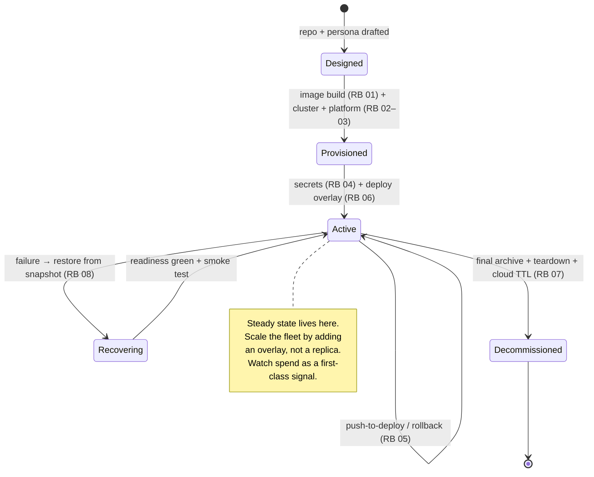

# OpenClaw on Kubernetes — Operations & Support

The README's Lifecycle section is the map; this is the territory. Runbooks are the *procedures*; this
doc is the *operating model* — when to run them, who owns what, and how you know the fleet is healthy.
For an agent fleet there is one operational signal most infrastructure docs omit and we treat as
first-class: **spend**.

The lifecycle, as a state machine:

<!-- START_GENERATED:docs/diagrams/src/lifecycle.mermaid -->

<!-- END_GENERATED:docs/diagrams/src/lifecycle.mermaid -->

---

## Day-0 — Provision (stand it up)

What must exist before the workload lands: substrate, identity, secret store, networking, backup
destination. Owned by [`runbooks/_common/01`](runbooks/_common/01-image-build/RUNBOOK.md) (image) +
the active profile's provisioning + bootstrap runbooks
([`profile-local-k3s-gcp/02–04`](runbooks/README.md)). **Exit criterion:** platform prerequisites
verified green — secret store `Valid`, backup CronJobs scheduled, the ingress/mesh namespace labeled.

## Day-1 — Deploy (land the workload)

First successful deploy + smoke test, via
[`profile-local-k3s-gcp/06`](runbooks/profile-local-k3s-gcp/06-deploy-workload/RUNBOOK.md). **Exit
criterion:** workload serving, `/healthz` green over the Service, `ExternalSecret` `SecretSynced`, and
a **proven rollback path** (`kubectl delete ns <id>` is the floor; Git revert for config).

## Day-2 — Operate (run it like it matters)

The steady state, where most of the lifecycle's real cost and risk live.

### Monitoring & Observability

| Signal | What it tells you | Source | Alert threshold |
|---|---|---|---|
| Liveness / readiness | workload up & serving | probes on `/healthz` | not-ready > 5 min |
| CPU / memory | capacity headroom | metrics | > 80% sustained |
| State-sync / backup success | corpus durability intact | backup CronJob logs | any failure |
| Restore-drill result | recovery is *verified*, not assumed | weekly drill job | any red → treat backups unverified |
| **Token / turn spend** | cost attribution + runaway detection | per-turn token logging | **per-agent budget exceeded → alert** |
| Error / retry rate | failing tools or model calls | logs | spike vs baseline (retry storm) |
| `replicas != 1` | single-writer drift | deploy spec | any deviation → page |

> For agent workloads, **spend is a first-class operational signal** — wire a per-agent budget alert
> at the billing layer and log tokens-in/out per turn so the bill is attributable. The traps that
> create silent spend (heartbeats, polling, retry storms) are catalogued in
> [COST-MODEL §3](COST-MODEL.md#3-️-runtime-cost-traps-read-before-deploying); the design default is
> heartbeats **off**, event-driven wakes on.

### Capacity & Scaling

The fleet grows by **adding an overlay (an agent/pod)**, never by raising a replica count — two
writers for one corpus is corruption ([ADR-0001](adr/0001-workload-primitive-deployment-over-statefulset.md)).
Headroom signal: schedule pressure / sustained node CPU/mem > 80% → add a node. The ceiling of the
current substrate is the sum of node capacity; because pods are node-agnostic, capacity is fungible
across the cluster.

### Upgrade & Patch Cadence

- **Workload / image:** push-to-deploy, digest-pinned; cadence: on runtime release (Runbook 01 → 05).
- **Platform / cluster:** K3s upgrades are the operator's job on this profile (vs a provider's on
  `managed-k8s`); declarative, runbook-driven, one node at a time.
- **OS / firmware (self-hosted):** on a regular cadence per the node fleet's policy.
- Change is **declarative** — a push/apply, never an out-of-band edit a reconciler would revert.

### Backup & Restore (verified)

- **RPO** ≈ 1h (hourly snapshots) / **RTO** minutes (a stateless pod recovers by pulling its prefix).
- Snapshots run hourly to GCS (client-encrypted); retention `keep-hourly 24 / daily 7 / weekly 4`.
- **A backup nobody has restored is not a backup** — the weekly drill restores *and* smoke-tests
  recovered state (Runbook 08), not just integrity.

## Support Model & Break-Fix

| Tier | Scope | Owner | Where |
|---|---|---|---|
| **Self-heal** | reschedule on node loss, retry transient errors | the platform (automatic) | — |
| **Operator** | break-fix, restore, rollback, spend triage | you / the platform owner | [troubleshooting](runbooks/profile-local-k3s-gcp/09-troubleshooting/RUNBOOK.md) + [update/rollback](runbooks/_common/05-update-and-rollback/RUNBOOK.md) |
| **Escalation** | substrate/provider-level (cloud service outage, IAM) | the cloud provider | provider support |

- **On-call posture:** single-operator fleet — best-effort / business-hours. The design absorbs node
  failure without paging (self-heal), so paging is reserved for corpus-durability or runaway-spend
  events.
- **Known failure modes → response:** the [LLD failure-modes table](LLD.md#10-failure-modes) and the
  [HLD risk register](HLD.md#12-risks--open-questions); every row points to a runbook.

## Day-N — Decommission (retire cleanly)

Final state archive → `kubectl delete ns <id>` → object-store TTL/cleanup → secret-manager key
removal → repo archived, via [`runbooks/_common/07`](runbooks/_common/07-decommission/RUNBOOK.md).
**Leaving no orphaned cloud spend is part of the job** — the close-out check confirms the state
prefix, secret versions, and any agent-specific Pub/Sub subscription are gone, because those are the
line items that quietly keep billing.
